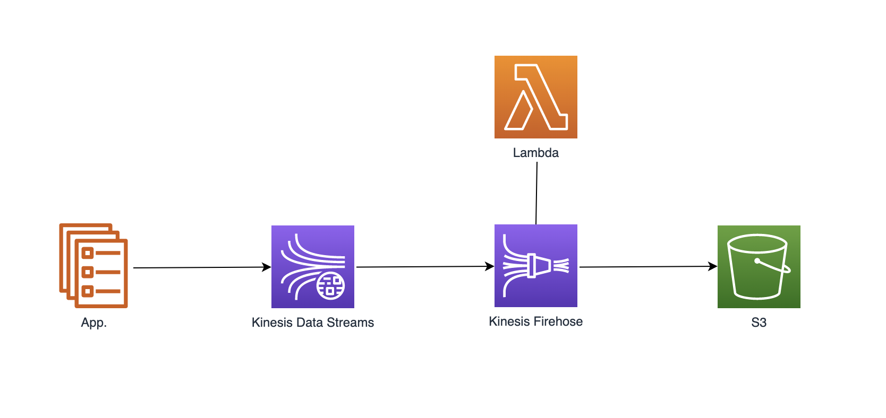
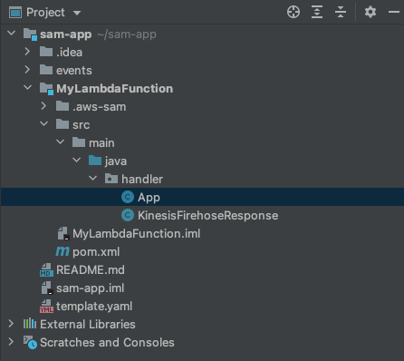

# aws-kinesis-lambda-demo


## Blueprint



## Lambda 개발 환경 구성
### Lambda
- 이벤트 중심 서버리스 컴퓨팅 서비스
- 이벤트가 트리거 할 때만 실행되며, 실행될 때만 비용 지불
- 인프라 관리없이 zip 파일 또는 컨테이너 이미지로 업로드 가능
- Lambda Input, Output에 다양한 AWS 서비스 연동 가능  
</br>

#### 1. AWS SAM(Serverless Application Model) CLI 설치
```
brew tap aws/tap
brew install aws-sam-cli
```
https://docs.aws.amazon.com/ko_kr/serverless-application-model/latest/developerguide/what-is-sam.html
</br>

#### 2. AWS Toolkit for IntelliJ 설치
IntelliJ Marketplace > AWS Toolkit for IntelliJ 플러그인 설치  
</br>

#### 3. 프로젝트 생성 
New Project > AWS > AWS Serverlless Application  
왼쪽 하단 AWS Explorer 탭에서 자원 확인 가능  
</br>

#### 4. 프로젝트 수정
템플릿 기본 애플리케이션은 Amazon API Gateway를 사용하는 Lambda 함수
kinesis 이벤트를 받는 Lambda Function으로 수정  
</br>


</br>

App.java
```java
import com.amazonaws.services.lambda.runtime.Context;
import com.amazonaws.services.lambda.runtime.LambdaLogger;
import com.amazonaws.services.lambda.runtime.events.KinesisFirehoseEvent;
import java.nio.ByteBuffer;

public class App
{
    public KinesisFirehoseResponse handleRequest(KinesisFirehoseEvent event, Context context) {
        LambdaLogger logger = context.getLogger();
        KinesisFirehoseResponse response = new KinesisFirehoseResponse();

        for(KinesisFirehoseEvent.Record rec : event.getRecords()) {
            System.out.println(rec.toString());
            ByteBuffer payload = rec.getData();
            String payloadStr = new String(payload.array());
            System.out.println(payloadStr);

            // data payload processing

            KinesisFirehoseResponse.FirehoseRecord record = new KinesisFirehoseResponse.FirehoseRecord();
            record.setRecordId(rec.getRecordId());
            record.setResult(KinesisFirehoseResponse.TRANSFORMED_STATE_OK);
            record.setData(payloadStr); // Base64 Encoding
            response.records.add(record);
        }
        return response;
    }
}
```
