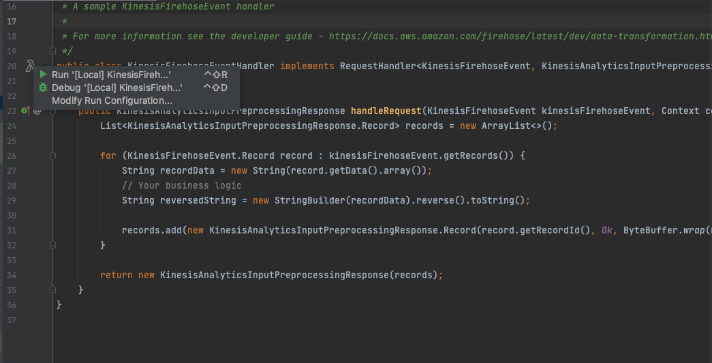
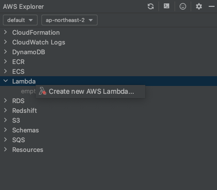
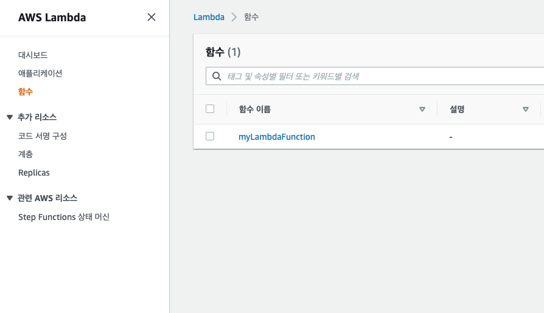

# aws-firehose-lambda-demo

## Lambda 개발 환경 구성
### Lambda
- 이벤트 중심 서버리스 컴퓨팅 서비스 (서버관리 필요없이 서비스 개발에 집중 가능)
- 이벤트가 트리거 할 때만 실행되고 비용 발생
- 인프라 관리없이 zip 파일 또는 컨테이너 이미지로 업로드
- 다양한 AWS 서비스와 연동 용이 
- 모니터링 용이
</br>

#### 사전 준비
- AWS 계정 및 권한
- AWS CLI
- Docker (Lambda Local 실행 시 필요)
</br>

#### 1. AWS SAM(Serverless Application Model) CLI 설치
```
brew tap aws/tap
brew install aws-sam-cli
```
https://docs.aws.amazon.com/ko_kr/serverless-application-model/latest/developerguide/what-is-sam.html

</br>

#### 2. AWS Toolkit for IntelliJ 설치
IntelliJ Marketplace > AWS Toolkit for IntelliJ 플러그인 설치  
</br>

#### 3. Firehose Event Handler Example
https://github.com/aws/aws-lambda-java-libs/tree/master/samples/kinesis-firehose-event-handler  
https://docs.aws.amazon.com/ko_kr/firehose/latest/dev/data-transformation.html  

</br>

#### 4. 로컬 실행
(docker 실행 필요)  
클래스 옆 Lambda 아이콘에 마우스 왼쪽 버튼을 누르고 Run 클릭


**Lambda input 설정**  
file 지정시 aws-lambda-java-libs/samples/kinesis-firehose-event-handler/src/test/resources/event.json  
text 지정시 kinesis Firehose 선택  
  

로컬 실행 결과 확인  

</br>

#### 6. AWS Lambda Function 생성
AWS Explorer > Lambda > create new AWS Lambda  


function, role, zip 저장용 s3 bucket 설정  


AWS Lambda Function 생성 확인 (remote test 가능)  

</br>

</br>
