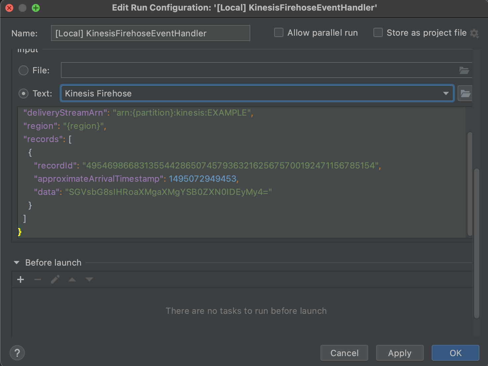

# aws-kinesis-lambda-demo


## Blueprint


## Lambda 개발 환경 구성
### Lambda
- 이벤트 중심 서버리스 컴퓨팅 서비스 (서버관리 필요없이 서비스 개발에 집중 가능)
- 이벤트가 트리거 할 때만 실행되고 비용 발생
- 인프라 관리없이 zip 파일 또는 컨테이너 이미지로 업로드
- 다양한 AWS 서비스와 연동 용이 
</br>

#### 사전 준비
- AWS 계정 및 권한
- AWS CLI
- Docker (Lambda Local 실행 시 필요)
</br>

#### 1. AWS SAM(Serverless Application Model) CLI 설치
```
brew tap aws/tap
brew install aws-sam-cli
```
https://docs.aws.amazon.com/ko_kr/serverless-application-model/latest/developerguide/what-is-sam.html

</br>

#### 2. AWS Toolkit for IntelliJ 설치
IntelliJ Marketplace > AWS Toolkit for IntelliJ 플러그인 설치  
</br>

#### 3. 프로젝트 생성 (IntelliJ)
New Project > AWS > AWS Serverlless Application  
왼쪽 하단 AWS Explorer 탭에서 자원 확인 가능  
</br>

#### 4. 프로젝트 수정
템플릿 기본 애플리케이션은 Amazon API Gateway를 사용하는 Lambda 함수  
kinesis 이벤트를 받는 Lambda Function으로 수정  
</br>


</br>

App.java
```java
package handler;

import com.amazonaws.services.lambda.runtime.Context;
import com.amazonaws.services.lambda.runtime.LambdaLogger;
import com.amazonaws.services.lambda.runtime.events.KinesisFirehoseEvent;
import java.nio.ByteBuffer;

public class App
{
    public KinesisFirehoseResponse handleRequest(KinesisFirehoseEvent event, Context context) {
        LambdaLogger logger = context.getLogger();
        KinesisFirehoseResponse response = new KinesisFirehoseResponse();

        for(KinesisFirehoseEvent.Record rec : event.getRecords()) {
            System.out.println(rec.toString());
            ByteBuffer payload = rec.getData();
            String payloadStr = new String(payload.array());
            System.out.println(payloadStr);

            // data payload processing

            KinesisFirehoseResponse.FirehoseRecord record = new KinesisFirehoseResponse.FirehoseRecord();
            record.setRecordId(rec.getRecordId());
            record.setResult(KinesisFirehoseResponse.TRANSFORMED_STATE_OK);
            record.setData(payloadStr); // Base64 Encoding
            response.records.add(record);
        }
        return response;
    }
}
```
</br>

KinesisFirehoseResponse.java
```java
package handler;

import java.util.ArrayList;
import java.util.Base64;

public class KinesisFirehoseResponse {
    static public final String TRANSFORMED_STATE_OK = "Ok"; // Ok(레코드가 성공적으로 변환되었음)
    static public final String TRANSFORMED_STATE_DROPPED = "Dropped"; // Dropped(처리 로직에 의해 의도적으로 레코드가 삭제됨)
    static public final String TRANSFORMED_STATE_PROCESSINGFAILED = "ProcessingFailed"; // ProcessingFailed(레코드를 변환하지 못함)

    ArrayList<FirehoseRecord> records = new ArrayList<FirehoseRecord>();

    static class FirehoseRecord{
        private String recordId;
        private String result;
        private String data;

        public String getRecordId() {
            return recordId;
        }

        public void setRecordId(String recordId) {
            this.recordId = recordId;
        }

        public String getResult() {
            return result;
        }

        public void setResult(String result) {
            this.result = result;
        }

        public String getData() {
            return data;
        }

        public void setData(String data) {
            this.data = Base64.getEncoder().encodeToString(data.getBytes());
        }
    }
}
```
</br>

template.yaml
```yaml
AWSTemplateFormatVersion: '2010-09-09'
Transform: AWS::Serverless-2016-10-31
Description: >
  sam-app

  Sample SAM Template for sam-app

# More info about Globals: https://github.com/awslabs/serverless-application-model/blob/master/docs/globals.rst
Globals:
  Function:
    Timeout: 20

Resources:
  MyLambdaFunction:
    Type: AWS::Serverless::Function # More info about Function Resource: https://github.com/awslabs/serverless-application-model/blob/master/versions/2016-10-31.md#awsserverlessfunction
    Properties:
      CodeUri: MyLambdaFunction
      Handler: handler.App::handleRequest
      Runtime: java11
      Architectures:
        - x86_64
      MemorySize: 512
      Environment: # More info about Env Vars: https://github.com/awslabs/serverless-application-model/blob/master/versions/2016-10-31.md#environment-object
        Variables:
          PARAM1: VALUE

```
</br>

#### 5. Lambda Function 로컬 테스트
(docker 실행 필요)  
클래스 옆 Lambda 아이콘에 마우스 왼쪽 버튼을 누르고 Run 클릭


Lambda input 설정 (kinesis firehose template)후 실행


로컬 실행 결과 확인 "Hello, this is a test 123."

</br>

#### 5. AWS Lambda Function 생성 (리모트) 
AWS Explorer > Lambda > create new AWS Lambda


function, role, zip저장 s3 bucket 설정


리모트 실행 가능

</br>
